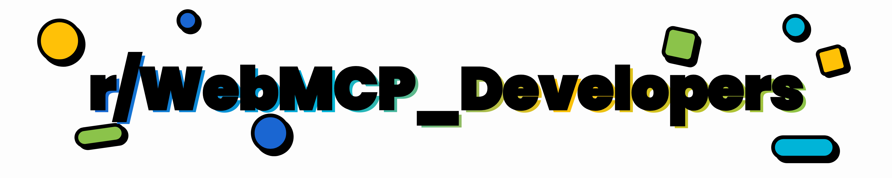

# Awesome WebMCP

**The browser standard that lets any website expose structured JavaScript tools directly to in-browser AI agents via `navigator.modelContext`.**

---

## 📋 Contents

- [📜 Official Specs & Documentation](#-official-specs--documentation)
- [🚀 Getting Started & Browser Setup](#-getting-started--browser-setup)
- [📖 Tutorials & Hands-On Guides](#-tutorials--hands-on-guides)
- [📦 Libraries, SDKs & Polyfills](#-libraries-sdks--polyfills)
- [🎮 Demos & Example Projects](#-demos--example-projects)
- [🔧 Developer Tools & Utilities](#-developer-tools--utilities)
- [🎬 Videos & Talks](#-videos--talks)
- [📝 Articles & Best Practices](#-articles--best-practices)
- [👥 Community & Contributing](#-community--contributing)
- [🔗 Related: MCP Ecosystem](#-related-mcp-ecosystem)

---

## 📜 Official Specs & Documentation

**The authoritative sources. Read these first.**

- [WebMCP Spec (W3C Community Group Draft)](https://webmachinelearning.github.io/webmcp) - Full IDL, tool registration, schemas, and security model.
- [WebMCP GitHub Repo](https://github.com/webmachinelearning/webmcp) - Spec source, issues, and the declarative explainer PR.
- [Awesome WebMCP (Official)](https://github.com/webmachinelearning/awesome-webmcp) - Curated list maintained by the Web Machine Learning Community Group.
- [Chrome Early Preview Announcement](https://developer.chrome.com/blog/webmcp-epp) - How WebMCP fits into Chrome 146+.
- [Chrome WebMCP Usage Guide](https://developer.chrome.com/blog/webmcp-mcp-usage) - Agent integration details and practical usage patterns.
- [Model Context Protocol (MCP) Core Spec](https://modelcontextprotocol.io/specification/latest) - The server-side counterpart that WebMCP brings to the browser.

---

## 🚀 Getting Started & Browser Setup

**Enable WebMCP first to start experimenting.**

### Browser Flags

- **Chrome Canary / Beta 146+** - Navigate to `chrome://flags`, search **"WebMCP for testing"** (or "Experimental Web Platform features"), enable, and restart.

### Essential Extensions

- [Model Context Tool Inspector](https://chromewebstore.google.com/detail/model-context-tool-inspec/gbpdfapgefenggkahomfgkhfehlcenpd) - Official GoogleChromeLabs tool for debugging schemas, testing tool calls, and visualizing registered tools. Part of [GoogleChromeLabs/webmcp-tools](https://github.com/GoogleChromeLabs/webmcp-tools).
- [MCP-B Chrome Extension](https://chromewebstore.google.com/detail/mcp-b-extension/daohopfhkdelnpemnhlekblhnikhdhfa) - Bridges desktop MCP agents with in-browser WebMCP tools + polyfill support.

---

## 📖 Tutorials & Hands-On Guides

**Step-by-step walkthroughs covering both the Declarative API (HTML attributes) and the Imperative API (`navigator.modelContext.registerTool`).**

- [MCP-B Tutorials](https://docs.mcp-b.ai/tutorials) - Best practical series: vanilla HTML, React (`useWebMCP` hook), native Chrome preview, desktop agent relay.
- [Codely: What is WebMCP and How to Use It](https://codely.com/en/blog/what-is-webmcp-and-how-to-use-it) - Excellent declarative + imperative breakdown with real-site examples.
- [BetterStack Complete Guide](https://betterstack.com/community/guides/ai/webmcp-ai-web/) - Deep dive with a flight-booking example app.
- [MCP-B How-To Guides](https://docs.mcp-b.ai/how-to) - Adoption strategies, existing app integration, runtimes (native vs polyfill vs global).

---

## 📦 Libraries, SDKs & Polyfills

**Production-ready helpers so you don't reinvent the wheel.**

### MCP-B Ecosystem

The official companion library suite for WebMCP.

- [MCP-B Documentation](https://docs.mcp-b.ai/) - Polyfill, types, React hooks, transports, and iframe bridging.
- [MCP-B npm Packages](https://github.com/WebMCP-org/npm-packages) - Source for all packages: `@mcp-b/webmcp-polyfill`, `@mcp-b/webmcp-types`, `usewebmcp`, `@mcp-b/global`.

### Standalone Libraries

- [webmcp-react](https://github.com/MCPCat/webmcp-react) - React hooks for exposing typed tools via `navigator.modelContext`. Zod-first schemas, built-in polyfill, SSR-compatible (Next.js/Remix), and StrictMode-safe with reactive execution state tracking.
- [webmcp-kit](https://github.com/victorhuangwq/webmcp-kit) - Zod-typed tool definitions, ideal for modern TypeScript/React apps.
- [WebMCP Widget Library](https://webmcp.dev) - One-line `<script>` tag for quick demos and prototyping. [GitHub](https://github.com/jasonjmcghee/WebMCP).
- [webmcp-sdk](https://github.com/up2itnow0822/webmcp-sdk) - W3C WebMCP developer toolkit with x402 payment support. Make any website agent-ready with `navigator.modelContext`. Includes TypeScript types, tool helpers, and x402 payment integration for Base.
- [agentpay-mcp](https://www.npmjs.com/package/agentpay-mcp) - Non-custodial x402 payment layer for AI agents (v4.0.0). Handles HTTP 402 Payment Required automatically — agent wallet signs on Base and retries. Patent Pending.

---

## 🎮 Demos & Example Projects

**Live sites you can test with the inspector + agent. All from GoogleChromeLabs or high-quality community implementations.**

### GoogleChromeLabs Official Demos

From the [webmcp-tools](https://github.com/GoogleChromeLabs/webmcp-tools) repo:

- [Le Petit Bistro](https://googlechromelabs.github.io/webmcp-tools/demos/french-bistro/) - Restaurant booking demo using the declarative API.
- [React Flight Search](https://googlechromelabs.github.io/webmcp-tools/demos/react-flightsearch/) - Flight search with imperative tool registration.
- [ZaMaker Pizza Builder](https://googlechromelabs.github.io/webmcp-tools/demos/pizza-maker/) - Custom pizza ordering via imperative API.
- [WebMCP Maze](https://googlechromelabs.github.io/webmcp-tools/demos/webmcp-maze/) - Full agent-driven maze navigation game.
- [Mystery Doors](https://googlechromelabs.github.io/webmcp-tools/demos/doors/) - Interactive puzzle with AI agent collaboration.

### Community Demos

- [Air Bird Booking](https://github.com/hugozanini/air-bird-booking-web-mcp) - Agent-native flight + accommodation booking. 10x fewer tokens than DOM scraping.
- [Shoe Store](https://andreinwald.github.io/webmcp-demo) - React e-commerce storefront with full WebMCP integration.
- [WebMCP Blackjack](https://webmcp-blackjack.heejae.dev) - Multi-agent blackjack game.
- [Excalidraw + WebMCP](https://shidh.in/demo/webmcp-excalidraw) - Diagram generation driven by AI agents.
- [Architecture Flow Builder](https://webmcp-flow.vercel.app) - Visual architecture diagramming with agent assistance.
- [AgentPay x402 Payment Demo](https://googlechromelabs.github.io/webmcp-tools/demos/x402-payment/) - AI agent makes x402 micropayments (HTTP 402 Payment Required) through `navigator.modelContext`. Wallet auto-signs on Base and retries. Shows both declarative + imperative tool patterns. [Code](https://github.com/GoogleChromeLabs/webmcp-tools/tree/main/demos/x402-payment)

---

## 🔧 Developer Tools & Utilities

- [GoogleChromeLabs/webmcp-tools](https://github.com/GoogleChromeLabs/webmcp-tools) - Official toolkit: Model Context Tool Inspector extension, CLI utilities, and demo suite.
- [WebMCP Inspector](https://webmcpinspector.com/) - Online inspector for testing and debugging WebMCP tool registrations.
- [WordLift AI Readiness Audit](https://audit.wordlift.io/) - Scan your site for WebMCP / agent readiness.
- [WebMCP Cheat Sheet](https://www.webfuse.com/webmcp-cheat-sheet) - Quick-reference cheat sheet for declarative and imperative APIs, schemas, and common patterns.

---

## 🎬 Videos & Talks

- [Don't let AI agents push your buttons - use WebMCP instead!](https://www.youtube.com/watch?v=p1l8nkQAoUw) - Khushal Sagar (Chrome Staff Engineer) on why WebMCP replaces button-clicking agents.
- [WebMCP - Why it's awesome & How to use it](https://www.youtube.com/watch?v=xQAYZBDV5jg) - Full setup walkthrough with inspector and React integration.
- [Syntax.fm WebMCP Deep Dive](https://www.youtube.com/watch?v=sOPhVSeimtI) - In-depth discussion + live demo.
- [Alex Nahas (MCP-B creator) Interview](https://www.youtube.com/watch?v=6Po39iD6Pfs) - Origin story and vision for the MCP-B ecosystem.

---

## 👥 Community & Contributing

**Join the conversation on [r/WebMCP_Developers](https://www.reddit.com/r/WebMCP_Developers/) - show your projects, ask questions, and stay on top of the latest.**

- [Web Machine Learning Community Group](https://www.w3.org/community/webmachinelearning/) - Join to shape the spec.
- [WebMCP GitHub Issues & Discussions](https://github.com/webmachinelearning/webmcp/issues) - Report bugs, request features, discuss the spec.
- [r/WebMCP_Developers](https://www.reddit.com/r/WebMCP_Developers/) - Dedicated subreddit for WebMCP developers.

---

## 🔗 Related: MCP Ecosystem

**WebMCP pairs with full MCP clients (Claude Desktop, Cursor, etc.) via relays for end-to-end agent workflows.**

- [Model Context Protocol](https://modelcontextprotocol.io/) - Official MCP spec, SDKs, and quickstart guides.
- [MCP-B Desktop Agent Relay](https://docs.mcp-b.ai/tutorials) - Connect desktop MCP agents to in-browser WebMCP tools.

---

**[⬆ Back to Contents](#-contents)**

